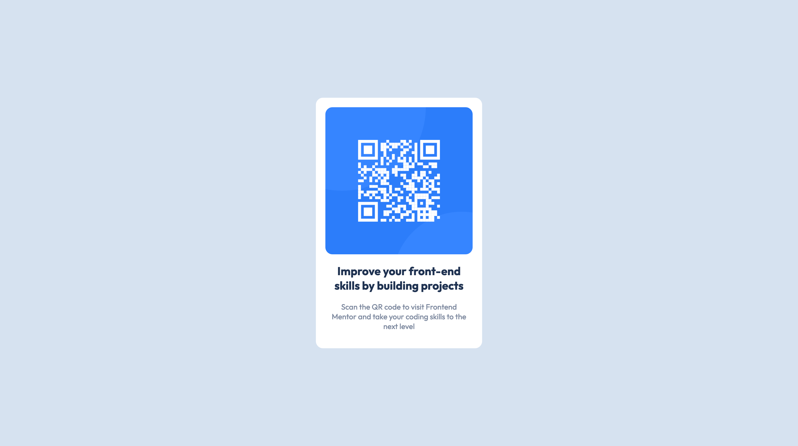

QR code component solution

This is a solution to the [QR code component challenge on Frontend Mentor](https://www.frontendmentor.io/challenges/qr-code-component-iux_sIO_H).

### Screenshot

### Links

- Solution URL: [https://github.com/surla/qr-code-component](https://github.com/surla/qr-code-component)
- Live Site URL: [https://surla.github.io/qr-code-component/](https://surla.github.io/qr-code-component/)

## Author

- Website - [https://www.josephsurla.com](https://www.josephsurla.com)
- Frontend Mentor - [@surla](https://www.frontendmentor.io/profile/surla)
- Twitter - [@josephsurla](https://www.twitter.com/josephsurla)
